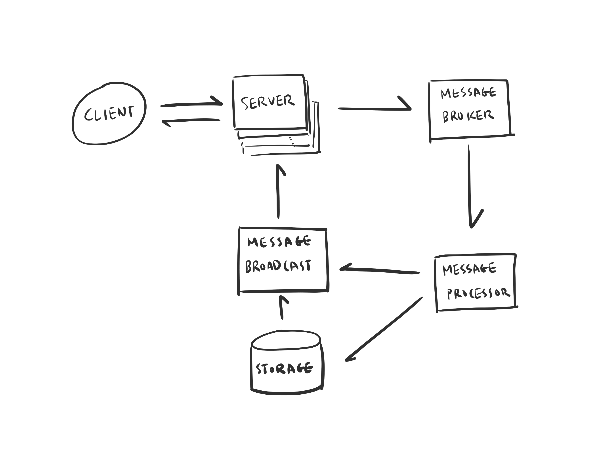
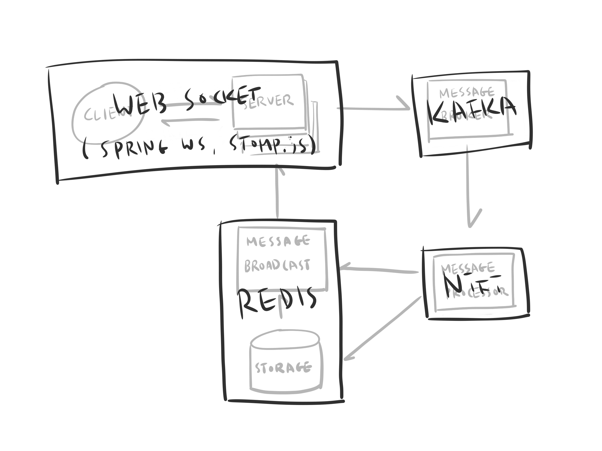
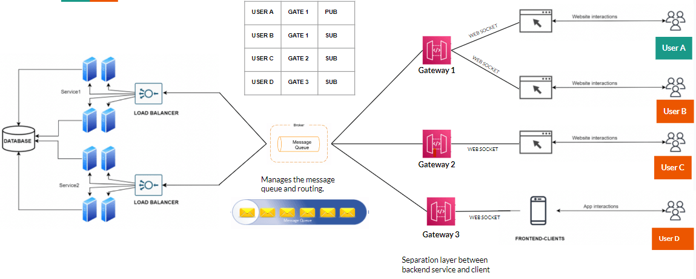

#  실시간 대규모 서비스 아키텍처
WebSocket은 실시간 양방향 통신에 적합하지만, 대규모 서비스에서는 몇 가지 한계가 있음.

## ❌ WebSocket 단독 사용의 한계

### 1. 서버 확장 문제 (수평 확장 어려움)

- WebSocket 연결은 특정 서버와 유지됨.
- __🔥 클라이언트가 A 서버에 연결되어 있는데, B 서버에서 메시지를 보내야 하면 직접 전송할 수 없음.__
- 해결책: Redis Pub/Sub, Kafka 를 사용해 여러 서버에서 메시지를 공유.

### 2. 메시지 손실 가능성

- WebSocket 연결이 끊어지면 해당 클라이언트는 메시지를 받을 수 없음.
- 서버가 다운되면 진행 중이던 메시지가 유실될 수도 있음.
- 해결책: Kafka, RabbitMQ 같은 메시지 큐를 사용해 메시지 영속성 보장.

### 3. 이전 메시지 불러오기 어려움

- WebSocket은 기본적으로 실시간 전송만 가능하고, 과거 메시지를 저장하지 않음.
- 해결책: MySQL, Cassandra 같은 DB를 사용해 채팅 기록 저장.

## 📌 2. WebSocket + 메시지 브로커(Kafka, Redis pub/sub, RabbitMQ) 조합이 필요한 이유

대규모 서비스에서는 WebSocket을 단독으로 쓰는 게 아니라, 메시지 브로커와 조합해서 사용.
이렇게 하면 서버 확장성 문제를 해결하면서도 실시간 채팅이 가능함.

### ✅ WebSocket + Redis Pub/Sub
- 클라이언트는 WebSocket을 통해 서버와 연결.
- 서버는 메시지를 Redis Pub/Sub을 이용해 다른 서버로 전달.
- 다만, Redis는 메시지를 영구 저장하지 않기 때문에 메시지 손실 가능성이 있음.

### ✅ WebSocket + Kafka (or RabbitMQ)
- Kafka나 RabbitMQ 같은 메시지 큐를 추가하면 메시지를 저장하고, 필요한 경우 다시 전달할 수 있음.
- 서버가 다운되더라도 Kafka가 메시지를 저장하고 있으므로 데이터 유실이 없음.

## 📌 3. 실제 서비스에서는 WebSocket을 어떻게 사용할까?

### ✅ Kakao Entertainment (WebSocket + Kafka + Redis)
- WebSocket: 클라이언트와 서버 간의 통신
- Kafka: 메시지 브로커. 채팅 서버간 메시지 전달 및 제어 Command, Event 메시지 처리.
- Redis: 실시간 데이터 저장

https://kakaoentertainment-tech.tistory.com/110

### ✅ Line (WebSocket + Redis Pub/Sub)
- WebSocket: 클라이언트와 서버 간의 통신
- Akka toolkit 을 통한 고속 병행 처리
- Redis Pub/Sub: 메시지 브로커. 서버 간의 코멘트 동기화

https://engineering.linecorp.com/ko/blog/the-architecture-behind-chatting-on-line-live

### ✅ Daum 실시간 댓글 (WebSocket + Redis + Kafka)
- WebSocket: 실시간 채팅 전송.
- Kafka: 메시지 브로커. 메시지를 임시적으로 저장하고, 메시지 전파.
- Redis:  메시지 저장, 빠른 읽기/쓰기 성능.
  https://tech.kakao.com/posts/390

### ✅ 배민 쇼핑라이브 채팅 (WebSocket + Redis pub/sub)
- WebSocket: 실시간 채팅 전송. Webflux 로 트래픽을 non-bloking 처리.
- Redis pub/sub: 메시지 브로커
- Redis 에 휘발되는 정보 저장, 방송이 끝나면 RDB에 저장.

https://techblog.woowahan.com/5268/

### ✅ Discord (WebSocket + Redis + ScyllaDB)
- WebSocket: 사용자가 음성/텍스트 채팅방에 접속하면 서버와 연결.
- Message Queue: 실시간 메시지 전파.
- MongoDB -> Cassandra -> ScyllaDB: 대량의 채팅 메시지를 단계별로 저장.

https://www.almabetter.com/bytes/articles/build-a-distributed-messaging-system-like-discord

## 4. 🚀 이슈 사항

### 🔥 대규모 실시간 서비스에서 룸(채널)이 많아질 경우 발생할 수 있는 메시지 브로커 과부하 문제, 확장성 이슈.

웹소켓 서버가 모든 룸의 메시지를 구독하게 되면:

#### 1. 불필요한 메시지 처리: 특정 웹소켓 서버에 연결된 클라이언트가 없는 룸의 메시지도 받게 됩니다.
#### 2. 메모리 사용량 증가: 관련 없는 메시지까지 처리해야 하므로 메모리 소비가 늘어납니다.
#### 3. 네트워크 대역폭 낭비: 필요 없는 메시지도 전송되어 네트워크 자원이 낭비됩니다.

### 🔥 대규모 서비스의 해결책

#### 1. 동적 구독 패턴:

웹소켓 서버는 현재 연결된 클라이언트가 있는 룸만 구독합니다.
클라이언트가 룸에 입장/퇴장할 때 구독 상태를 동적으로 변경합니다.

#### 2. 샤딩 및 파티셔닝:

룸을 여러 파티션으로 나누고, 웹소켓 서버가 특정 파티션만 담당합니다.
예: Discord는 "Guild(서버)" 단위로 샤딩을 구현했습니다.

#### 3. 계층형 메시징 구조:

슬랙의 아키텍처처럼 Gateway Server → Channel Server 구조로 나누어 부하를 분산합니다.
각 Gateway Server는 자신의 클라이언트와 관련된 채널 정보만 관리합니다.

#### 4. 메시지 필터링:

메시지 브로커 수준에서 필터링 메커니즘을 구현합니다.
예: RabbitMQ의 topic exchange, Kafka 의 consumer group 활용

#### 5. 로컬 라우팅 최적화:

✔ 같은 서버 인스턴스에 연결된 클라이언트 간의 메시지 전송을 최적화.

✔ 메시지 브로커가 병목 지점이 되지않게 방지 가능.

➡ 지역성 인식(Locality Awareness):

서버는 현재 자신에게 연결된 모든 클라이언트와 그들이 참여 중인 룸을 추적 구독합니다.
메시지 전송 시, 목적지 클라이언트가 동일한 서버에 있는지 확인합니다.

➡ 로컬 우회 라우팅(Local Bypass Routing):

메시지 발신자와 수신자가 같은 서버에 있다면, 메시지 브로커(Redis, RabbitMQ 등)를 거치지 않고 직접 전달합니다.
외부 서버의 클라이언트를 위한 메시지만 메시지 브로커에 발행합니다.

## 📌 5. 현재 구현사항

백엔드에서 RabbitMQ 메시지 브로커를 직접 사용.

클라이언트가 프론트에서 RabbitMQ STOMP 플러그인을 활용해 메시지 브로커에 직접 연결.

`클라이언트(브라우저) → 웹소켓 → RabbitMQ STOMP 플러그인 → RabbitMQ 메시지 브로커`

클라이언트는 STOMP 프로토콜을 사용하여 메시지 송수신.

## 📌 6. 아키텍처 고려사항

### ➡ 1안: 현재 아키텍처 그대로 RabbitMQ 메시지 브로커를 직접 사용.

현재 아키텍처를 유지하되, RabbitMQ 확장 고려. 메시징 브로커(RabbitMQ)가 연결과 메시지 라우팅을 담당.

여러 RabbitMQ 노드로 클러스터를 구성, 미러링 큐 설정 하여 동기화. 클라이언트가 분산된 메시지 브로커 시스템에 연결되는 구조.

장점:

- 메시지 보장성: 메시지 지속성과 확인 메커니즘을 제공하여 신뢰성 있는 전달 보장
- 풍부한 라우팅: 토픽, 팬아웃 등 다양한 교환 유형으로 복잡한 메시지 라우팅 지원
- 부하 분산: 큐를 통해 소비자 간 작업 부하 자연스럽게 분산
- 백프레셔 처리: 큐를 통한 버퍼링으로 과부하 상황 관리 용이
- 클러스터링 지원: 기본적인 확장성과 고가용성 제공

단점:

- 레이턴시: 메시지 브로커를 통과하므로 직접 소켓 연결보다 약간의 지연 발생

### ➡ 2안: 여러 Socket.IO + Redis

로컬 우회 라우팅으로 강의별 라우팅을 하여 같은 강의를 들을 클라이언트를 몰아 연결.

Redis 에서 룸 관리.

메시지 브로커 없이 클라이언트가 A 서버에 연결되어 있는데, B 서버에서 메시지를 보내야 하면 직접 전송할 수 없기 때문에 동일 Room에 속해있는 클라이언트는 같은 서버에 있어야 함.

장점:

- 낮은 레이턴시: 직접적인 연결로 더 빠른 메시지 전달
- 간단한 구현: WebSocket만 사용하는 경우 초기 구현이 더 단순
- 리소스 효율성: 중간 브로커 없이 직접 통신으로 리소스 절약

단점:

- 상태 관리 복잡성: 어떤 클라이언트가 어떤 서버에 연결되었는지 추적 필요. 복잡한 룸 관리.
- 메시지 라우팅 어려움: 서로 다른 서버에 연결된 클라이언트 간 통신을 위한 추가 메커니즘 필요
- 확장 제한: 서버 간 상태 공유와 동기화 어려움
- 신뢰성 낮음: 메시지 지속성과 재전송 메커니즘 직접 구현 필요

### ➡ 3안: Socket.IO + RabbitMQ + Redis cache

➡ WebSocket을 사용하지만, 대규모 트래픽을 감당하기 위해 메시지 브로커와 결합하는 구조가 일반적임.
동적 구독 패턴 적용, 로컬 라우팅을 사용하여 웹소켓을 최적화를 하여 부하를 줄이고 성능을 향상시킬수 있다.

➡ 현재 RabbitMQ 에 STOMP 플러그인하여 사용중이라 웹소켓 서버를 수평 확장하기 어려움.
지금 가지고 있는 RabbitMQ, Redis 를 활용하면서 Socket.IO 서버만 확장가능하게 하면 좀더 수월하게 구현이 가능할 듯함.

#### 작동 방식

- 클라이언트 연결: 사용자는 로드 밸런서를 통해 Socket.IO 서버 중 하나에 연결
- 서버 간 통신: Socket.IO 서버들은 RabbitMQ를 통해 서로 메시지 교환
- 메시지 전달: 한 서버에 연결된 클라이언트의 메시지가 다른 서버의 클라이언트에게 전달 가능
- 메시지 저장: 디비 저장을 위한 메시지 큐를 하나 만들어 API 에서 구독하여 디비 저장.

1. 클라이언트가 Socket.IO netty 서버에 연결. 강의별 개설된 룸에 조인. 이때 목록은 Redis 에 저장하여 관리.
2. 클라이언트가 메시지를 전달하면 RabbitMQ 에서 Fanout 하여 모든 서버에 메시지를 브로드캐스트 하는 동시에 Storage Queue 를 쌓음.
3. API 서버들이 Storage Queue 를 구독하고 있다가 메시지를 가져와 RDB 에 채팅 메시지를 저장. 큐는 경쟁 소비자 패턴으로 작동하며 서버중 하나만 메시지를 처리.
4. 새로 들어온 클라이언트는 api 로 이전 채팅 메시지를 가져오며 동시에 소켓서버에서 강의 룸에 입장하여 최신 메시지를 이어 받게 됨.
5. 강의를 듣는 사용자가 없으면 룸은 종료되고 Redis room 정보도 삭제.

장점

- 확장성 향상: Socket.IO 서버를 독립적으로 수평 확장 가능
- 낮은 레이턴시: 동일 서버에 연결된 클라이언트 간 직접 통신
- 신뢰성 있는 메시지 전달: 서버 간 통신에 RabbitMQ의 신뢰성 활용. Redis pub/sub 보다 메시지 보장한다고 함.
- 부하 분산: 로드 밸런서와 Socket.IO 클러스터로 부하 분산
- 장애 대응: 한 서버가 실패해도 다른 서버로 연결 재조정 가능